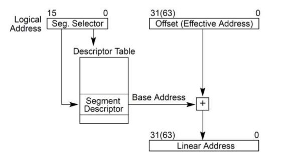
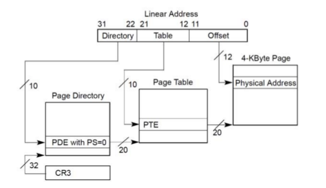
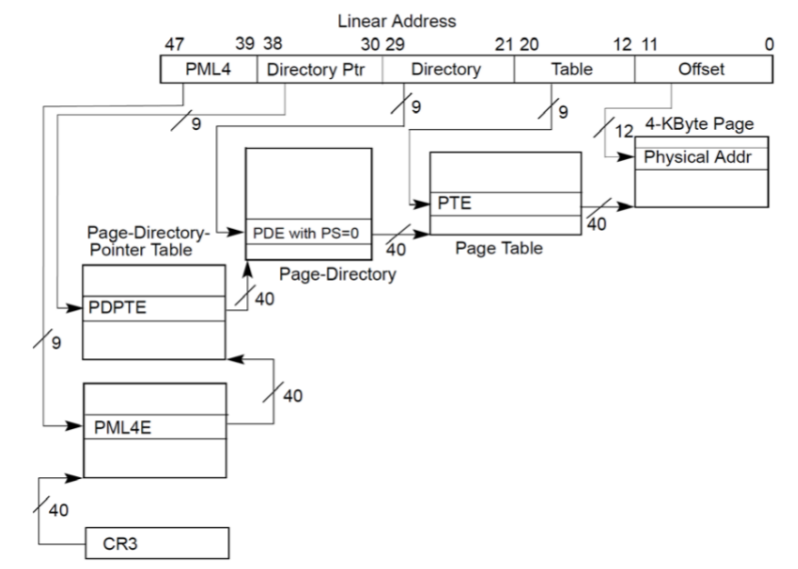

# 1. IA-32

## 1.1 寄存器速查

    共有10个32位和6个16位寄存器。类型分为分为通用、控制、段寄存器。

#### 1.1.1 通用寄存器
    数据寄存器：EAX、EBX、ECX、EDX
    索引(Index)寄存器：ESI(Source)、EDI(Destination)
    指针(Pointer)寄存器：ESP(Stack / 栈顶)、EBP(Base / 栈底)

#### 1.1.2 控制寄存器
	EIP(跟踪下一条要执行的指令，也叫程序计数寄存器)、EFLAGS(保存系统的一些状态标志)     

#### 1.1.3 段寄存器
	CS、ES、DS、FS、GS、SS

#### 1.1.4 系统寄存器(初始化CPU、控制系统操作)
    EFLAGS的IOPL域：控制任务和模式的切换、中断处理、指令跟踪、访问权限
    控制寄存器：CR0、CR2、CR3、CR4包含用来控制系统级别操作的数据和信息，CR8是CPU特殊功能相关
    调试寄存器：DR[0-8]允许设置断点
    
#### 1.1.5 内存管理寄存器:(DTR=Descriptor Table Register)
	GDTR：Global,保存GDT的基址和表大小,LGDT设置、SGDT保存
	LDTR：Local,16位的段选择码、基址、段大小、LDT描述符属性,LLDT设置、SLDT保存
	IDTR：Interrupt,IDT的基址和大小，LIDT设置、SIDT保存
	TR：Task,在linux中未使用，16位段选择器、基址、大小、描述符属性
    

## 1.2 内存管理机制

   ** Linux采用平滑过渡， 线性地址==逻辑地址 **

#### 1.2.1 逻辑地址(Logical Address)
    在机器语言中，来说明操作数和指令的地址
    包含两部分：段(Segment) + 偏移量(Offset)

#### 1.2.2 线性/虚拟地址
    32位无符号整形，可以到4G
    dir + table + offset

#### 1.2.3 物理地址
    物理内存上的地址，也是32位无符号整形

#### 1.2.4 地址映射过程
    逻辑地址--(段式映射)-->线性地址--(页式映射)-->物理地址

## 1.3 逻辑地址(CPU发出的)到线性地址映射过程(段式映射)

    
    根据指令性质确定应该使用哪一个段寄存器
    根据段寄存器内容(段选择码在其中)，找到一个相应的地址段描述结构，段描述结构都放在一个表中（GDT或LDT、TR、IDT），而表的起始地址(基址)保存在GDTR、LDTR、IDTR、TR寄存器中
    从地址段描述结构中找到基地址
    将指令发出的地址作为位移，与段描述结构中规定的的段长度相比，看看是否越界
    根据指令的性质和段描述符中的访问权限来确定是否越权
    将指令中发出的地址作为位移，与基地址相加得出线性地址

    ps：段寄存器的高13位(低3位另作他用)用作访问段描述表中具体描述结构的下标(index)。GDTR或LDTR中的段描述表指针和段寄存器中给出的下标结合在一起,才决定了具体的段描述表项在内中的什么地方

## 1.4 线性地址到物理地址映射(页式映射)

    
    从CR3寄存器获取页目录的基地址
    以线性地址的dir位段为下标，在目录中取得相应的页面表的地址
    以线性地址中的page位段为下标，在所得到的页面表中获得相应的页面描述项
    将页面描述项中给出的页面基地址与线性地址中的offset位段相加得到物理地址

# 2 x64(4k页面下)

## 2.1 区别
    线性地址是48bits
    页面映射分为4级
    CR3保存最高一级表的起始物理地址
    每个表项都是8bytes

## 2.2 4级映射计算

   
    一个变量的地址为tmpaddr = 0x7FFF3FFD8FE8
     将线性地址分为5部分，用来4部分和最后offset计算
     即linearaddr = 48bit = 9 + 9 + 9 + 9 + 12
     tmpaddr = 011111111 111111100 111111111 111011000 111111101000 
- - -
first:

    读取CR3 保存最高级映射表的物理地址，这张最高级映射表保存着第二级映射表的地址
	CR3 = 0x62E604000 (最高级映射表的物理地址)
	2baseaddr = CR3 + 011111111b * 8 = 0x62E6047F8(phy,第二级表基址的物理地址) => 0x62C42C000(去物理地址读到value)
secound:

    3baseaddr = 2baseaddr + 111111100b * 8 = 0x62C42CFE0(phy) => 0x60D09F000(value)
third:

    4baseaddr = 3baseaddr + 111111111b * 8 = 0x60D09FFF8(phy) => 0x62EB81000(value)
fouth:

    找到tmp所在物理(4k)页面的起始地址
        phypagebase = 4baseaddr + 111011000b * 8 = 0x62EB81EC0(phy) => 0x6016E3000(value)
end:

    phypagebase += 111111101000b = 0x6016E3FE8    
    最终物理地址0x6016E3FE8存放的即为tmp的值

